

  <!--  -->
  

  
<strong>Prefer an online interactive version of this archive? Browse <a href="https://fishy.moe/client-cheating-archive">fishy.moe</a>.</strong>
  

  <h1>
     osu! Cheat List 
  </h1>
  
<em>A directory of osu! private server cheat clients & hacks. Where to find them and what they do.</em>

  
<em>Created May 24, 2023 · Updated June 28, 2026</em>

  
  
  
  &nbsp;&nbsp;|&nbsp;&nbsp;
  
  
  
  
  

> [!CAUTION]
> Cheats are detectable on Bancho and most [private servers](https://hinamizawa.ai/osu/servers/). Accounts have been banned for using every client listed here. This directory is preserved for educational and archival purposes. Links to legacy clients are kept for historical reference, not endorsement. Use at your own risk.

  
  &nbsp;&nbsp;
  <a href="https://fishy.moe">
    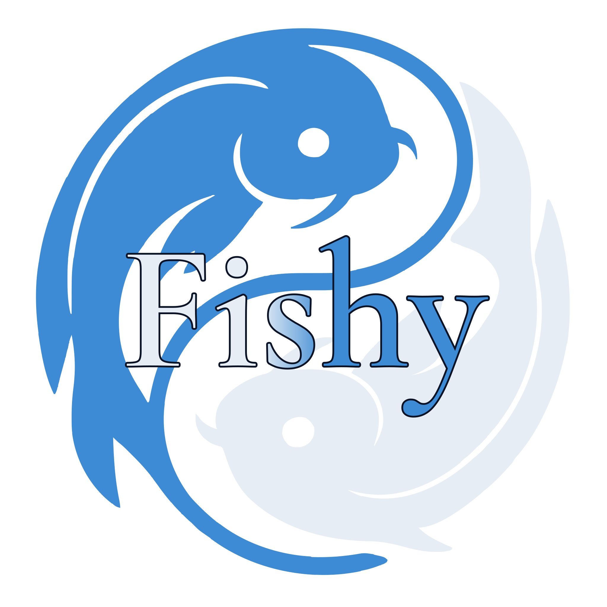
  </a>
  
<strong>The ONLY osu! <a href="https://hinamizawa.ai/osu/servers/">private servers</a> where these cheating clients are allowed are <a href="https://kawata.pw">kawata.pw</a> and <a href="https://fishy.moe">fishy.moe</a> (client test only).</strong>

  
Bancho and every other <a href="https://hinamizawa.ai/osu/servers/">private server</a> detect and ban these clients on score submission!

  <!-- 
Any other cheating <a href="https://hinamizawa.ai/osu/servers/">private server</a> that is known also work, if the following is aloud in their rules/doc
 -->

## Contents

- [Active Clients](#active-clients)
  - [Arc](#arc)
- [Under Maintenance](#under-maintenance)
  - [Aeris - Kawata](#kawata-aeris)
  - [Maple](#maple)
- [Under Development](#under-development)
  - [AQN Revived V3](#aqn-revived-v3)
  - [??????](#mystery-client)
- [Legacy / Archive](#legacy-archive)
  - [AQN V1 + V2](#aqn)
  - [Abypass](#abypass)
  - [Skooter](#skooter)
  - [Ainu](#ainu)
  - [freedom](#freedom)
  - [tuyosu](#tuyosu)
  - [paw!cheats](#paw-cheats)
  - [osu!rx](#osu-rx)
- [Resources](#resources)
  - [Patched osu! b20220424](#patched-osu)
- [Feature comparison](#feature-comparison)
- [Want to test your own cheat?](#test-your-cheat)
- [Play legit?](#play-legit)
- [Contributing](#contributing)
- [Contributors](#contributors)

## 

### Arc

  

> _Standalone osu! client by Aochi._

- **Status:** Active · Free
- **Maintainer:** [Aochi](https://github.com/7ez)
- **Download:** [m1.aochi.uk/r/osu!.exe](https://m1.aochi.uk/r/osu!.exe)
- **Cheats:**
  - Maple Aim Assist (V1-V3)
  - Aim Correction
  - Relax Hack
  - Timewarp
  - AR Changer · CS Changer · HD Remover · FL Remover

> [!WARNING]
> Do not put `osu!.exe` in your main osu! install. Make a new folder for the Arc client.

## 

_Clients that are temporarily down for updates. Their information and cheats are preserved below, but they're currently unavailable to buy or use until the next build ships._

### Aeris - [Kawata](https://kawata.pw) 

  

  
  
  

> [!IMPORTANT]
> **Aeris is temporarily on hold.** The owner and maintainer, TheFantasticLoki, is in the middle of relocating to another area ✈️ , so the download URL (`storage.kawata.pw`) is currently **offline**. Everything below is preserved and will be back as soon as the move is done and the download is restored.
>
> **`storage.kawata.pw` has been down since June 2, 2026.**
>
> **Fallback mirror added June 27, 2026:** while the official download is offline, Aeris is now mirrored at [fishy.moe/download/aeris](https://fishy.moe/download/aeris).

> _Active beta with modernized Skooter AC, Relax, Timewarp, and Aim Assist beta features._

- **Status:** Under maintenance · Download offline (maintainer relocating) · Public beta · Free
- **Maintainer:** <a href="https://github.com/TheFantasticLoki"> TheFantasticLoki</a> (originally <a href="https://github.com/PANIGE"> Panini Céleste</a>; contributions from <a href="https://maple.software/"> Maple Syrup</a>, [Chewy/Pythr](https://github.com/Pytxhr) and <a href="https://github.com/nyoemii"> noemi</a>)
- **Download:**
  - **Official:** [storage.kawata.pw](https://storage.kawata.pw/get/osu!Kawata.zip) *(currently offline, maintainer relocating)*
  - **Fallback:** [fishy.moe/download/aeris](https://fishy.moe/download/aeris)
- **Virus analysis:** [Hybrid Analysis report](https://www.hybrid-analysis.com/sample/3a08fea940bb7028b08b0a6688cae86344af3fc5ea2340ff03a29d95be090614)
- **Cheats:**
  - Aim Correction (improved Skooter AC, optional Tap-on-Correct for non-RX, relative range support)
  - Relax Hack (SkooterRX Improved)
  - Timewarp (rate & multiplier)
  - Automatic CS Changer · AR Changer · HD Remover · FL Remover
- **Beta features:**
  - Maple Aim Assist V1 + V2 (submitting); V3 and L-V1 not submitting
  - Dedicated input thread (aim only, 1/2/4/8/16K FPS options)
- **Dev features:**
  - Dev version has been updated to 64-bit and modern .NET 8.
  - Slightly better Windows integration for shortcuts and notifications.
  - Can run more stably and smoothly depending on the system.
  - Very experimental; performance is not guaranteed and depends on the system.

> [!TIP]
> Add the install folder as an antivirus exclusion to prevent issues.

### Maple

  

  
  

> [!IMPORTANT]
> Maple is currently going through updates and is **unavailable to purchase or use** right now. It is only handed out to a selected few within their circle. The details below are preserved for reference and will apply again once the next build is officially released.
>
> **Under development since December 13, 2024 following a source-code leak (per the official Discord announcement).**

> _Paid hack with no built-in limits, actively maintained._

- **Status:** Under maintenance · Temporarily unavailable · Paid
- **Maintainer:** Maple Syrup
- **Download:** <a href="https://maple.software/"> maple.software</a> *(temporarily unavailable)*
- **Discord:** [discord.gg/P9Yn8FfC2v](https://discord.com/invite/P9Yn8FfC2v)
- **Cheats:**
  - Aim Assist (3 versions)
  - Relax Hack
  - Timewarp
  - AR Changer · CS Changer · HD Remover · FL Remover

## 

_Upcoming clients that have been announced or previewed but are not released yet. Details and release dates can change._

> [!WARNING]
> Release dates are unknown and nothing is confirmed. Please do not bother or stress the developers about it.

### AQN Revived V3

  <a href="https://theaquila.network">
    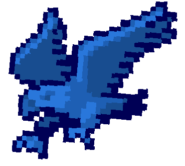
  </a>

> _A revival of AQN, in active development. Release date unknown._

- **Status:** Under development · Release date unknown
- **Developer:** <a href="https://github.com/ptrchain"> ptrchain</a>
- **Website:** [theaquila.network](https://theaquila.network)
- **Discord:** [discord.gg/jkYzjHyqMg](https://discord.gg/jkYzjHyqMg)

 

  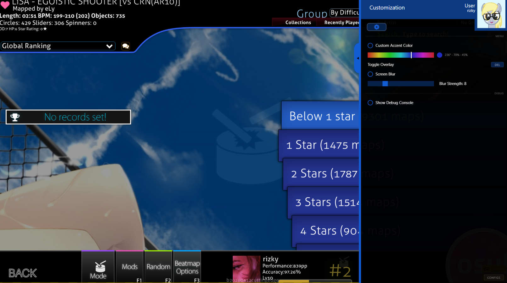
  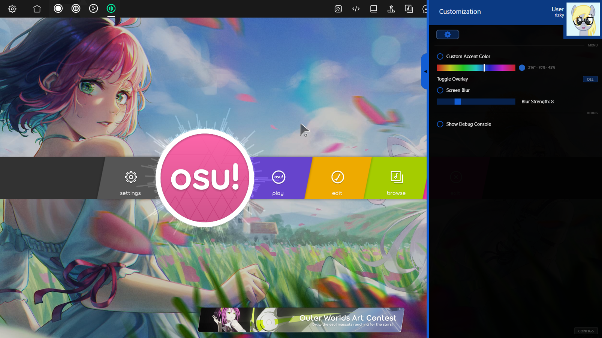

### ??????

> _An unannounced osu! client in early development. Name, feature set, and release date are all unknown._

- **Status:** Under development · Name and release date unknown
- **Lead Developer/Owner:** <a href="https://github.com/SimplyAe"> miracle</a> (of <a href="#paw-cheats">paw!cheats</a>)
- **Assistant:** <a href="https://github.com/nyoemii"> noemi</a> (of <a href="#tuyosu">tuyosu</a>)

 

  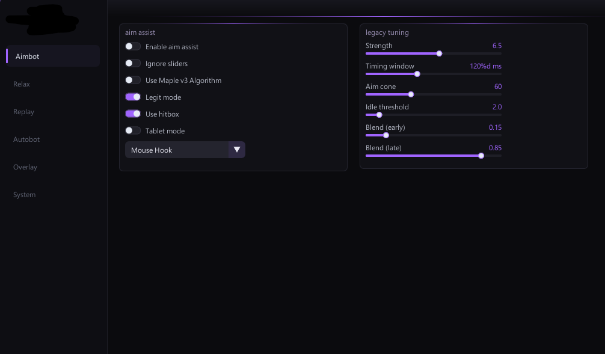
  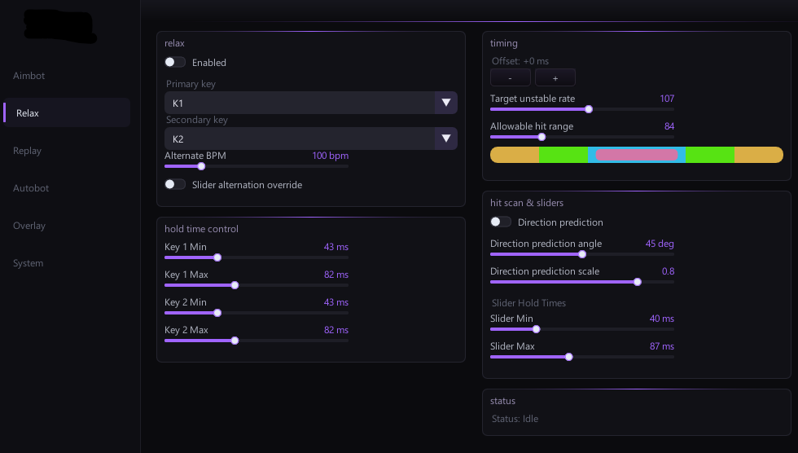
  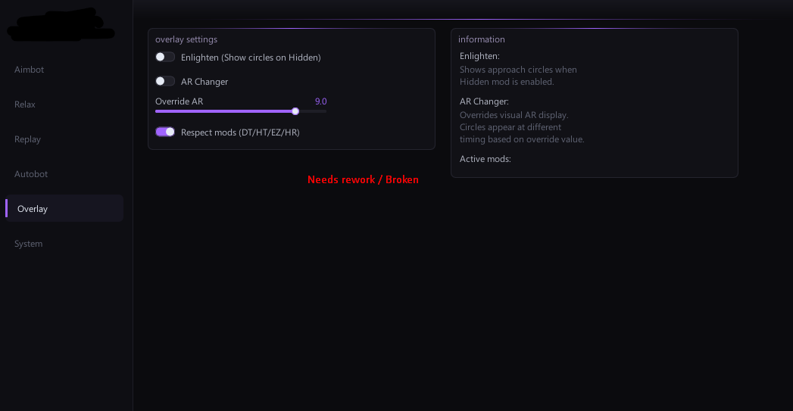

## 

_Discontinued or no-longer-maintained clients, kept here for historical reference. Most downloads will be broken or unsafe by now._

> [!WARNING]
> Discord CDN links rot without notice. Verify the file hash or get a fresh copy from MPGH or the relevant Discord before running anything. Scan every binary yourself ([VirusTotal](https://www.virustotal.com/), [Hybrid Analysis](https://www.hybrid-analysis.com/)) before execution.

### AQN V1 + V2

  

> _AQN V1 was the original AQN by Kevin, later continued as V2 by Rumoi. Now free; crashes on the current osu! version._

- **Status:** Archived · Broken on current osu!
- **Maintainer:**  Kevin (original developer, V1) and <a href="https://github.com/rumoi"> Rumoi</a> (V2). Both unmaintained.
- **Download:**
  - [theaquila.net](https://theaquila.net/) *(legacy site)*
  - [github.com/rumoi/AQN_nologin](https://github.com/rumoi/AQN_nologin) *(no-login / free version)*

### Abypass

> _Successor to Skoot.er, mostly discontinued. Downloads have been lost._

- **Status:** Archived · Downloads lost
- **Maintainer:** [Chewy/Pythr](https://github.com/Pytxhr) (previously <a href="https://github.com/7ez"> Aochi</a>; unmaintained)
- **Download:**
  - [abypass.fumo.lol/updater](https://abypass.fumo.lol/updater) *(unverified)*
  - [cute.cat-girls.club mirror](https://cute.cat-girls.club/u/logytbz.zip)
- **Discord:** [discord.gg/RFj2839kbw](https://discord.gg/RFj2839kbw)
- **Cheats:**
  - Aim Correction
  - HD Remover
  - CTB Relax Hack (control catcher with mouse)
  - Automatic CS Changer
  - Relax Hack · Timewarp · AR Changer · FL Remover
- **Other features:** In-game PP counter · Built-in updater · Server switcher

### Skooter

> _Predecessor to Abypass. No longer maintained._

- **Status:** Archived · Unmaintained
- **Maintainer:** Aoba Suzukaze, VacCat, [Chewy/Pythr](https://github.com/Pytxhr) (unmaintained)
- **Download:**
  - [skooter.shibe.lol](https://skooter.shibe.lol/) *(main link)*
  - [Patched build](https://cdn.discordapp.com/attachments/598976475579809860/1082588578858680330/skooter_b5.exe) *(Discord CDN, for increased Aim Correction)*
  - [skooter_new](https://cdn.discordapp.com/attachments/883824772021108736/1083581690284359841/skooternew.zip) *(Discord CDN, if Skooter won't open)*

### Ainu

> _Predecessor to Skooter and Abypass. No longer maintained._

- **Status:** Archived · Unmaintained
- **Maintainer:** Aoba Suzukaze; edits by [Chewy/Pythr](https://github.com/Pytxhr) (unmaintained)
- **Download:**
  - [Main link](https://cdn.discordapp.com/attachments/827128975897657344/889117178744434738/ainu-cheat.exe) *(Discord CDN)*
  - [Alternate version](https://cdn.discordapp.com/attachments/837034085478039574/902318926980071434/ainu-cheat_1.exe) *(Discord CDN)*

> [!CAUTION]
> Only download from trusted sources (MPGH, the Skoot.er Discord, or the Ainu Cheaters Discord). Copies from elsewhere are known to contain unsafe modifications.

### freedom

  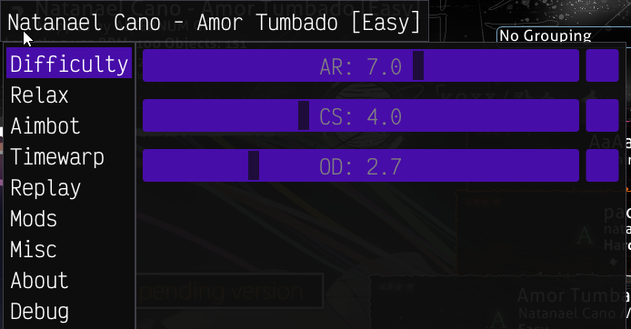

> _DLL-injected osu! cheat by Ciremun, originally posted on UnKnoWnCheaTs in 2023. GitHub repo offline; only the forum mirror remains._

- **Status:** Archived · Unmaintained · GitHub offline
- **Maintainer:** [Ciremun](https://github.com/Ciremun) (account/repo offline · unmaintained)
- **Download:**
  - [UnKnoWnCheaTs attachment](https://www.unknowncheats.me/forum/downloads.php?do=file&id=41014) *(forum mirror)*
  - [github.com/Ciremun/freedom](https://github.com/Ciremun/freedom) *(repo offline)*
- **Source thread:** [UnKnoWnCheaTs: osu! hack](https://www.unknowncheats.me/forum/other-games/588133-osu-hack.html)
- **Format:** DLL. Inject with any injector (Extreme Injector recommended)
- **Cheats:**
  - Aimbot
  - Relax Hack
  - Timewarp
  - Replay
  - Mods (Unmod Flashlight, Score Multiplier)
  - Misc

> [!WARNING]
> The GitHub repo is offline. Only the UnKnoWnCheaTs attachment remains, and DLLs posted on cheat forums frequently carry tampered builds, so scan every binary yourself ([VirusTotal](https://www.virustotal.com/), [Hybrid Analysis](https://www.hybrid-analysis.com/)) before injecting.

### tuyosu

  

> _Short-lived standalone osu! cheat by noemi; never affiliated with Kawata. Released July 26, 2025, shut down June 5, 2026._

- **Status:** Archived · Discontinued (shut down June 5, 2026) · Free
- **Lifespan:** July 26, 2025 to June 5, 2026 (~10 months)
- **Maintainer:** <a href="https://github.com/nyoemii"> noemi</a> (unmaintained)
- **Download:** [fishy.moe/download/tuyosu](https://fishy.moe/download/tuyosu)
- **Cheats:**
  - Aim Correction
  - Timewarp
  - CS Changer
  - AR Changer
  - FL Remover

> [!NOTE]
> Listed for archival completeness. The logo above was contributed by tuyosu's developer, noemi, who reached out and gave permission to mirror the last worked-on version on fishy.moe, free to download and give away.

### paw!cheats

  

> _Short-lived, heavily-modified 2026 osu! client by miracle: a standalone, multi-mode cheat with humanized bots. Never publicly released but has pre-view images._

- **Status:** Archived · Discontinued · Standalone · Free
- **Lifespan:** April 15 to May 18, 2026 (~1 month, per the developer's edit timestamps)
- **Maintainer:** <a href="https://github.com/SimplyAe"> miracle</a> (unmaintained)
- **Base:** A 2026 osu! client, heavily modified, with per-mode menus for osu! / Taiko / Catch / Mania.
- **Download:** Unavailable, never publicly released.
- **Cheats:**
  - Aim Assist V5: magnetic cursor pull (Strength, Base FOV, Humanization, Flow)
  - Aim Correction: tunable; works alongside Aim Assist
  - Human Autobot (osu!): humanized cursor movement (Aim Spread, Curve Strength); cursor-only, pair with Relax for clicks
  - Humanized auto-bots for Taiko & Mania: jack detection, fatigue, chord correlation, phantom releases, timing jitter
  - Click Assist / Relax: auto-clicks every object on time (score unranked); adjustable offset
  - Timewarp (with AR compensation) · AR Changer · CS Changer · HD Remover · FL Remover
  - Server switcher · hardware identity (HWID) profiles
- **Misc / visuals:**
  - Lazer notelock logic · insta-fade (keeps skin colors)
  - Long / tube trail (Danser-style rainbow trail; WIP, could crash) + trail length
  - Circle fade-out timing · DT/NC playback on a selected song

> [!NOTE]
> The **Catch (CTB) auto-bot was removed** before release (miracle couldn't fix its memory leaks), so the Catch tab is wiped despite still appearing in the mode menu. Two builds appear in the screenshots. All details and images are developer-provided; paw!cheats was never publicly downloadable.

 

  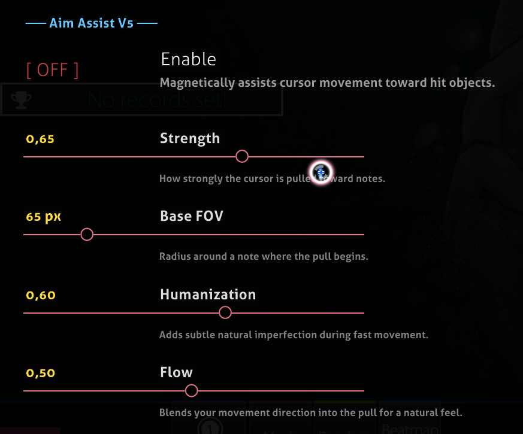
  
<em>Aim Assist V5: magnetic cursor pull, with Strength, Base FOV, Humanization and Flow.</em>

  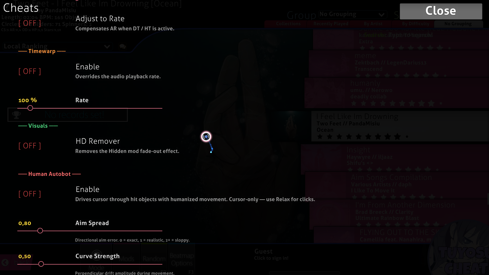
  
<em>Cheats menu: Timewarp, HD Remover, and the Human Autobot.</em>

  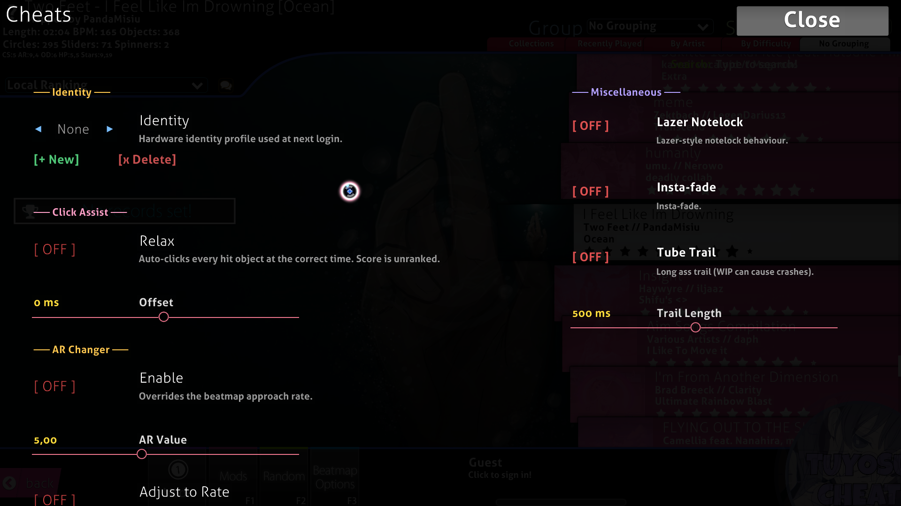
  
<em>Identity (HWID) profiles, Click Assist / Relax, AR Changer, and Miscellaneous (lazer notelock, insta-fade, tube trail).</em>

  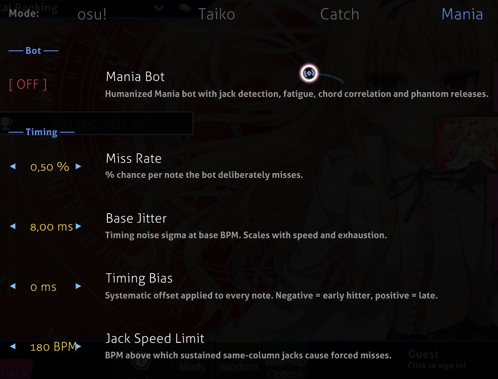
  
<em>Mania bot: jack detection, fatigue, chord correlation and phantom releases.</em>

  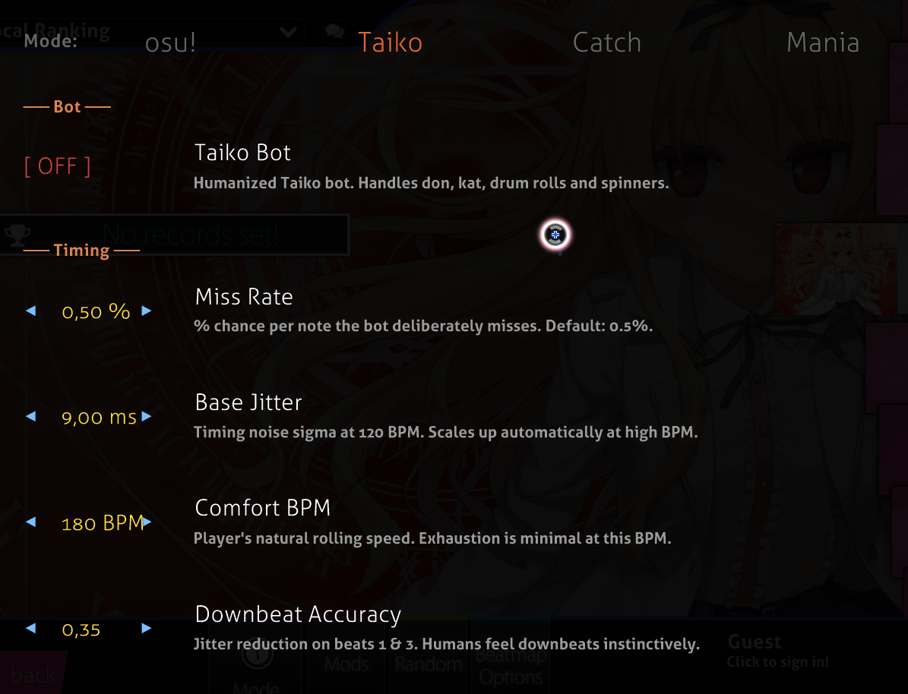
  
<em>Taiko bot: don/kat, drum rolls and spinners, with humanized timing.</em>

### osu!rx

> _Relax and aim hack for the legacy osu! b20220424 build._

- **Status:** Archived · Free · Requires a patched osu! b20220424 build · Download currently unavailable
- **Maintainer:** Sasuke (originally mrflashstudio)
- **Download:** No direct link found right now; try the [MPGH thread](https://www.mpgh.net/forum/showthread.php?t=1538659) or the osu!rx Discord for a current source.
- **Setup:**
  1. osu!rx does **not** run on the latest osu!. Download [b20220424](https://fishy.moe/download/osu-b20220424).
  2. Apply a TLS-patched `osu.exe` (see note below).
  3. Create a `_STAGING` file in your osu! folder to block auto-updates.

> [!NOTE]
> The original Discord CDN mirror for the TLS-patched `osu.exe` is no longer reachable. Ask MPGH or the osu!rx Discord for a current source.

## Resources

### Patched osu! b20220424

> _Base client required by osu!rx and other legacy hacks._

- **Status:** Archival snapshot
- **Download1:** [fishy.moe snapshot (b20220424.zip)](https://fishy.moe/download/osu-b20220424)
- **Download2:** [osekai.net snapshot (b20220424.zip)](https://osekai.net/snapshots/versions/b20220424/b20220424.zip)
- **Notes:** The alternate Discord CDN mirror was removed after going offline in 2025.

## Feature comparison

| Feature | Arc | Aeris | Maple |
|---|:---:|:---:|:---:|
| Aim Assist / Correction | ✅ | ✅ | ✅ |
| Relax Hack | ✅ | ✅ | ✅ |
| Timewarp | ✅ | ✅ | ✅ |
| AR / CS Changer | ✅ | ✅ | ✅ |
| HD / FL Remover | ✅ | ✅ | ✅ |
| Cost | Free | Free | 💰 Paid |
| Works on current osu! | ✅ | 🟠 | 🟠 |

| Client | Status | Cost | Type | Current osu! | Download |
|---|---|:---:|:---:|:---:|:---:|
| [**Arc**](#arc) |  | Free | Standalone | ✅ | [Direct download](https://m1.aochi.uk/r/osu!.exe) |
| [**Aeris**](#kawata-aeris) |  | Free | Standalone | 🟠 | [fishy.moe/download/aeris](https://fishy.moe/download/aeris) *(fallback)* |
| [**Maple**](#maple) |  | 💰 Paid | Standalone | 🟠 | _unavailable_ |
| [**AQN Revived V3**](#aqn-revived-v3) |  | TBD | TBD | TBD | [theaquila.network](https://theaquila.network) |
| [**??????**](#mystery-client) |  | TBD | TBD | TBD | _unreleased_ |
| [**AQN V1 + V2**](#aqn) |  | Free | Standalone | ❌ | [GitHub repo](https://github.com/rumoi/AQN_nologin) |
| [**Abypass**](#abypass) |  | Free | Standalone | ❌ | [Updater mirror](https://abypass.fumo.lol/updater) |
| [**Skooter**](#skooter) |  | Free | Standalone | ❌ | [Project site](https://skooter.shibe.lol/) |
| [**Ainu**](#ainu) |  | Free | Standalone | ❌ | [Discord CDN](https://cdn.discordapp.com/attachments/827128975897657344/889117178744434738/ainu-cheat.exe) |
| [**freedom**](#freedom) |  | Free | DLL inject | ❌ | [UnKnoWnCheaTs](https://www.unknowncheats.me/forum/downloads.php?do=file&id=41014) |
| [**tuyosu**](#tuyosu) |  | Free | Standalone | ❌ | [fishy.moe/download/tuyosu](https://fishy.moe/download/tuyosu) |
| [**paw!cheats**](#paw-cheats) |  | Free | Standalone | ❌ | _none_ |
| [**osu!rx**](#osu-rx) |  | Free | b20220424 | ❌ | _none found_ |

<!-- 
🟢 Active &nbsp;·&nbsp; 🟠 Under maintenance &nbsp;·&nbsp; ⚪ Legacy / archived -->

## Want to test your own cheat?

  <a href="https://dev.fishy.moe">
    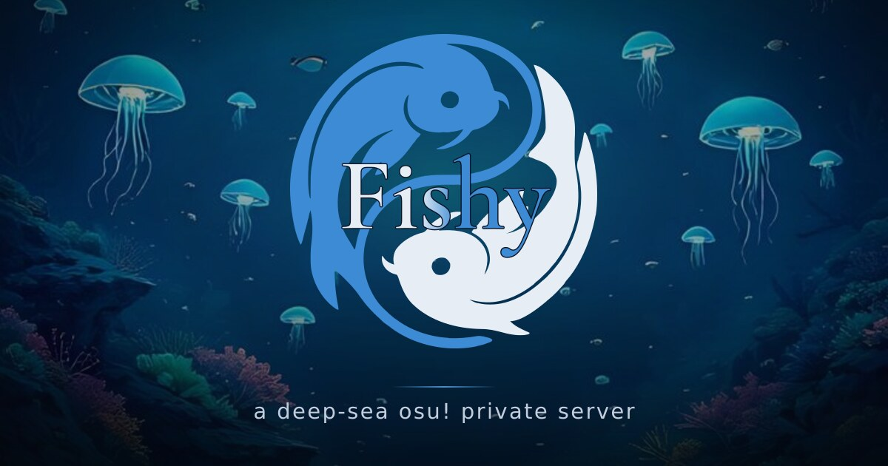
  </a>

<a href="https://dev.fishy.moe">dev.fishy.moe</a> is a special playground for testing & developing unreleased cheats to apply in future for kawata.pw. It runs a <a href="https://github.com/kawatapw/kawata.py">kawata backend</a> with customizations from <a href="https://github.com/osu-NoLimits/bancho.py-ex">bancho.py-ex</a>. The backend is fully reworked and rewritten for this purpose, so it stands as a "sister" build of kawata dedicated to testing.

To connect a cheat or osu! client for testing, launch osu! with the `-devserver fishy.moe` switch, then log in with your <a href="https://dev.fishy.moe">fishy.moe</a> account. The server runs fully over HTTPS, so the client reaches it on the standard bancho subdomains without extra setup. Full steps are on the <a href="https://dev.fishy.moe/rules">fishy.moe rules and connection guide</a>.

### Need to host or back up your cheat?

Beyond testing, we can also host a download URL for your cheat on fishy.moe. If your own mirror link breaks or you do not run a server, we can store a backup so others can still use your work. Everything we host lives under <a href="https://fishy.moe/download">fishy.moe/download</a>, where each cheat gets its own stable link. The <a href="#tuyosu">tuyosu</a> entry above is one example: with the developer's permission it now ships from a stable <a href="https://fishy.moe/download/tuyosu">fishy.moe/download/tuyosu</a> link that will not expire. Get in touch if you want the same for your client.

## Play legit?

  

The maintainer of this archive also runs a few free osu! tools on hinamizawa.ai, strictly non-cheating utilities for legit play and exploration:

- [**Beatmap Mirror**](https://hinamizawa.ai/osu/beatmaps/): Search and download. PP on every card across 14 mod combos. Leaderboards, fail graphs, background downloads. 10 cascading mirror sources, all 4 game modes.
- [**PP Farm Maps**](https://hinamizawa.ai/osu/pp-maps/): 144,000+ ranked beatmaps with pre-calculated PP for 14 mod combinations. Filter by PP range, star rating, BPM, mode.
- [**Beatmap Packs**](https://hinamizawa.ai/osu/map-packs/): 3,750+ curated packs across 7 categories (Standard, Featured Artist, Tournament, Loved, Spotlights, Theme, Artist), 263,000+ difficulties with PP per difficulty.
- [**Private Server List**](https://hinamizawa.ai/osu/servers/): A directory of every osu! private server found online, with live stats. All are strictly non-cheating servers and will ban on sight if you cheat on score submission.

No login required.

## Contributing

  

This is a curated archive. PRs welcome for:

- Corrections to existing entries (broken links, updated maintainers, status changes)
- New legacy / archived clients with historical significance
- Fresh virus-analysis links (Hybrid Analysis, VirusTotal)

PRs adding **new actively-developed cheat clients** are reviewed case-by-case, so please open an issue first. Every download link must be paired with a virus-scan link.

## Contributors

<table>
  <tr>
    <td align="center" width="140">
      <a href="https://github.com/alejandroatacho">
         
        <b>alejandroatacho</b>
      </a>
    </td>
    <td>
      Originally moderator and guide writer for <a href="#aqn">AQN (V1 + V2)</a>; now Administrator &amp; Developer at <a href="https://kawata.pw/u/12396">Kawata</a>, Overwatcher at <a href="https://osu.gatari.pw/u/17181">Gatari</a> and Owner / Solo Developer of <a href="https://hinamizawa.ai">hinamizawa.ai</a> & <a href="https://fishy.moe">fishy.moe</a>.
    </td>
  </tr>
  <tr>
    <td align="center" width="140">
      <a href="https://github.com/TheFantasticLoki">
         
        <b>TheFantasticLoki</b>
      </a>
    </td>
    <td>
      Owner and Lead Developer of <a href="https://kawata.pw/u/1488">Kawata</a> and the Aeris client. Indirect contributor. The upstream <a href="https://kawata.pw/u/1488">Kawata</a> docs are also one of this archive's sources of information.
    </td>
  </tr>
  <tr>
    <td align="center" width="140">
      <a href="https://github.com/nyoemii">
         
        <b>noemi (nyoemii)</b>
      </a>
    </td>
    <td>
      Developer of <a href="#tuyosu">tuyosu</a>, Alumni of <a href="https://kawata.pw">Kawata</a> - Aeris Client. Contributed to this archive and gave permission to host the last worked-on version of tuyosu on <a href="https://fishy.moe">fishy.moe</a>, free to download so it stays available online.
    </td
  </tr>
  <tr>
    <td align="center" width="140">
      <a href="https://github.com/7ez">
         
        <b>Aochi</b>
      </a>
    </td>
    <td>
      Original owner of Fuquila and alumni Backend Developer at <a href="https://kawata.pw">Kawata</a>. Now Solo Developer and Maintainer of <a href="#arc">Arc</a>, with many contributions to other osu! projects around the community.
    </td>
  </tr>
  <tr>
    <td align="center" width="140">
      <a href="https://github.com/Xyrohh">
         
        <b>Hugo (Xyrohh)</b>
      </a>
    </td>
    <td>
      Co-Owner, Global Community Manager, and Score Hunt Event Manager / Host / Planner at <a href="https://kawata.pw/u/13233">kawata.pw</a>.
    </td>
  </tr>
  <tr>
    <td align="center" width="140">
      <a href="https://github.com/iotazz">
         
        <b>iotazz (Aleks)</b>
      </a>
    </td>
    <td>
    2023 MPGH File testers and unsafe urls; <a href="https://kawata.pw">Kawata</a> Support/Gestion alumni.
    </td>
  </tr>
</table>

---

Information data found via ban appeals on private servers & self research/communication with the underground community · some information mirrored from <a href="https://kawata.pw">Kawata</a>'s in-game cheat docs · Old Legacy entries preserved from the 2023 archive original research team.

---

  

